## OcCo: Occlusion Completion for Point Cloud Pre-Training
This repository is the official implementation of "OcCo: Occlusion Completion for Point Cloud Pre-Training"

[Paper] [[Project Page](https://hansen7.github.io/OcCo/)] [Code is here]

### Intro

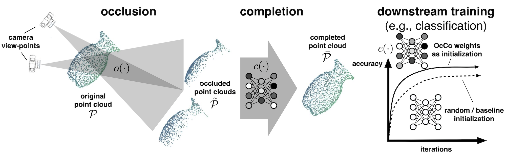

In this work, we train a completion model that learns how to reconstruct the occluded points, given the partial point cloud. In this way, our method learns a pre-trained representation that can identify the visual constraints inherently embedded in real-world point clouds. 

We call our method **Occlusion Completion (OcCo)**. We demonstrate that OcCo learns representations that: improve generalization on downstream tasks over prior pre-training methods, transfer to different datasets, reduce training time, and improve labeled sample efficiency.


### Citation
we will release the paper in the near future :)

```

```

### Usage

We provide codes in both PyTorch (1.3): <a href="OcCo_Torch">OcCo_Torch</a> and TensorFlow (1.13-1.15): <a href="OcCo_TF">OcCo_TF</a>, both can reproduce the results reported in the paper. We also provide with docker configuration <a href="OcCo_Torch/docker">docker</a>. Our recommended development environment PyTorch + docker, the following description are based on  <a href="OcCo_Torch">OcCo_Torch</a>, we refer the readme in the  <a href="OcCo_TF">OcCo_TF</a> for the details of TensorFlow implementation.


#### 1) Prerequisite

##### Docker

In the <a href="OcCo_Torch/docker">docker</a> folder, we provide the build, configuration and launch scripts:

```
docker
| - Dockerfile_Torch  # configuration
| - build_docker_torch.sh  # scripts for building up from the docker images
| - launch_docker_torch.sh  # launch from the built image
| - .dockerignore  # ignore the log and data folder while building up 
```

which can be automatically set up as following:

```bash
# build up from docker images
cd OcCo_Torch/docker
sh build_docker_torch.sh

# launch the docker image, conduct completion/classification/segmentation experiments
cd OcCo_Torch/docker
sh launch_docker_torch.sh
```

##### Non-Docker Setup

Just go with `pip install -r Requirements_Torch.txt` with the `PyTorch 1.3.0, CUDA 10.1, CUDNN 7`  (otherwise you may encounter errors while building the C++ extension <a href="OcCo_Torch/chamfer_distance">chamfer_distance</a> for calculating the Chamfer Distance), my development environment besides docker is `Ubuntu 16.04.6 LTS, gcc/g++ 5.4.0, cuda10.1, CUDNN 7`.


#### 2) Pre-Training via Occlusion Completion (OcCo)

##### Data Usage:

For the details in the data setup, please see <a href="OcCo_Torch/data/readme.md">data/readme.md</a>.

##### Training Scripts:

We unify the training of all three models (`PointNet`, `PCN` and `DGCNN`) in <a href="OcCo_Torch/train_completion.py">train_completion.py</a>. We also provide the bash template for training each models, see <a href="OcCo_Torch/bash_template/train_completion_template.sh">bash_template/train_completion_template.sh</a> for details:

```bash
#!/usr/bin/env bash

cd ../

# train pointnet-occo model on ModelNet, from scratch
python train_completion.py \
	--gpu 0,1 \
	--dataset modelnet \
	--model pointnet_occo \
	--log_dir modelnet_pointnet_vanilla ;

# train dgcnn-occo model on ShapeNet, from scratch
python train_completion.py \
	--gpu 0,1 \
	--batch_size 16 \
	--dataset shapenet \
	--model dgcnn_occo \
	--log_dir shapenet_dgcnn_vanilla ;
```

##### Pre-Trained Weights

We will provide the OcCo pre-trained models for all the three models, you can use them for visualization of completing self-occluded point cloud, fine tuning on classification and semantic segmentation tasks.


#### 3) Sanity Check on Pre-Training

We use t-SNE for dimensionality reduction to visualize the object embeddings of the ShapeNet10 data obtained through OcCo pre-trained encoders on the ModelNet40 dataset, see <a href="OcCo_Torch/utils/TSNE_Visu.py">utils/TSNE_Visu.py</a> for details.

We also train a Support Vector Machine (SVM) based on embeddings output by these OcCo pre-trained encoders for classification tasks. It is in <a href="OcCo_Torch/train_svm.py">train_svm.py</a>. We also provide the bash template for training, see <a href="OcCo_Torch/bash_template/train_svm_template.sh">bash_template/train_svm_template.sh</a> for details:

```bash
#!/usr/bin/env bash

cd ../

# grid search the best svm parameters with rbf kernel on ModelNet40 encoded by OcCo PCN
python train_svm.py \
	--gpu 0 \
	--grid_search \
	--model pcn_util \
	--dataset modelnet40 \
	--restore_path log/completion/modelnet_pcn_vanilla/checkpoints/best_model.pth ;


# ... on ScanObjectNN(OBJ_BG) encoded by OcCo DGCNN
python train_svm.py \
	--gpu 0 \
	--grid_search \
	--batch_size 8 \
	--model dgcnn_util \
	--dataset scanobjectnn \
	--bn \
	--restore_path log/completion/modelnet_dgcnn_vanilla/checkpoints/best_model.pth ;
```


#### 4) Fine Tuning - Classification

##### Data Usage:

For the details in the data setup, please see <a href="OcCo_Torch/data/readme.md">data/readme.md</a>.

##### Training/Testing Scripts:

We unify the training and testing of all three models (`PointNet`, `PCN` and `DGCNN`) in <a href="OcCo_Torch/train_cls.py">train_cls.py</a>. We also provide the bash template for training each models from scratch, JigSaw/OcCo Pre-Trained checkpoints, see <a href="OcCo_Torch/bash_template/train_cls_template.sh">bash_template/train_cls_template.sh</a> for details:

```bash
#!/usr/bin/env bash

cd ../

# training pointnet on ModelNet40, from scratch
python train_cls.py \
	--gpu 0 \
	--model pointnet_cls \
	--dataset modelnet40 \
	--log_dir modelnet40_pointnet_scratch ;


# fine tuning pcn on ScanNet10, using jigsaw pre-trained checkpoints
python train_cls.py \
	--gpu 0 \
	--model pcn_cls \
	--dataset scannet10 \
	--log_dir scannet10_pcn_jigsaw \
	--restore \
	--restore_path log/completion/modelnet_pcn_vanilla/checkpoints/best_model.pth ;


# fine tuning dgcnn on ScanObjectNN(OBJ_BG), using jigsaw pre-trained checkpoints
python train_cls.py \
	--gpu 0,1 \
	--epoch 250 \
	--use_sgd \
	--scheduler cos \
	--model dgcnn_cls \
	--dataset scanobjectnn \
	--bn \
	--log_dir scanobjectnn_dgcnn_occo \
	--restore \
	--restore_path log/completion/modelnet_dgcnn_vanilla/checkpoints/best_model.pth ;


# test pointnet on ModelNet40 from pre-trained checkpoints
python train_cls.py \
	--gpu 1 \
	--epoch 1 \
	--mode test \
	--model pointnet_cls \
	--dataset modelnet40 \
	--log_dir modelnet40_pointnet_scratch \
	--restore \
	--restore_path log/cls/modelnet40_pointnet_scratch/checkpoints/best_model.pth ;
```


#### 5) Fine Tuning - Semantic Segmentation

##### Data Usage:

For the details in the data setup, please see <a href="OcCo_Torch/data/readme.md">data/readme.md</a>.

##### Training/Testing Scripts:

We unify the training and testing of all three models (`PointNet`, `PCN` and `DGCNN`) in <a href="OcCo_Torch/train_semseg.py">train_semseg.py</a>. We also provide the bash template for training each models from scratch, JigSaw/OcCo Pre-Trained checkpoints, see <a href="OcCo_Torch/bash_template/train_semseg_template.sh">bash_template/train_semseg_template.sh</a> for details:

```bash
#!/usr/bin/env bash

cd ../

# train pointnet_semseg on 6-fold cv of S3DIS, from scratch
for area in $(seq 1 1 6)
do
python train_semseg.py \
	--gpu 0,1 \
	--model pointnet_semseg \
	--bn_decay \
	--xavier_init \
	--test_area ${area} \
	--scheduler step \
	--log_dir pointnet_area${area}_scratch ;
done

# fine tune pcn_semseg on 6-fold cv of S3DIS, using jigsaw pre-trained weights
for area in $(seq 1 1 6)
do
python train_semseg.py \
	--gpu 0,1 \
	--model pcn_semseg \
	--bn_decay \
	--test_area ${area} \
	--log_dir pcn_area${area}_jigsaw \
	--restore \
	--restore_path log/jigsaw/modelnet_pcn_vanilla/checkpoints/best_model.pth ;
done

# fine tune dgcnn_semseg on 6-fold cv of S3DIS, using occo pre-trained weights
for area in $(seq 1 1 6)
do
python train_semseg.py \
	--gpu 0,1 \
	--test_area ${area} \
	--optimizer sgd \
	--scheduler cos \
	--model dgcnn_semseg \
	--log_dir dgcnn_area${area}_occo \
	--restore \
	--restore_path log/completion/modelnet_dgcnn_vanilla/checkpoints/best_model.pth ;
done

# test pointnet_semseg on 6-fold cv of S3DIS, from saved checkpoints
for area in $(seq 1 1 6)
do
python train_semseg.py \
	--gpu 0,1 \
	--mode test \
	--model pointnet_semseg \
	--test_area ${area} \
	--scheduler step \
	--log_dir pointnet_area${area}_scratch \
	--restore \
	--restore_path log/semseg/pointnet_area${area}_scratch/checkpoints/best_model.pth ;
done
```


##### Visualization:

We recommended using relevant code snippets in [RandLA-Net](https://github.com/QingyongHu/RandLA-Net) for visualization.


#### 6) Data Generation (Create Your Own Dataset for OcCo Pre-Training)

For the details in the self-occluded point cloud generation, please see <a href="render/readme.md">render/readme.md</a>.


#### 7) Just Completion (Complete Your Own Data with Pre-Trained Model)

We will also provide the best OcCo checkpoints we have for the completion tasks, you can use it for completing your occluded point cloud data.


#### 8) Jigsaw Puzzle

We also provide our implementation (developed from scratch) on pre-training point cloud models via solving 3d jigsaw puzzles tasks as well as data generation, the method is described in this [paper](https://papers.nips.cc/paper/9455-self-supervised-deep-learning-on-point-clouds-by-reconstructing-space.pdf), while the authors did not reprocess to our code request. The details of our implementation is reported in our paper appendix.

For the details of our implementation, please refer to description in the appendix of our paper and relevant code snippets, i.e.,  <a href="OcCo_Torch/train_jigsaw.py">train_jigsaw.py</a>,  <a href="OcCo_Torch/utils/3DPC_Data_Gen.py">utils/3DPC_Data_Gen.py</a> and <a href="OcCo_Torch/bash_template/train_jigsaw_template.sh">train_jigsaw_template.sh</a>.


### Results

##### Generated Dataset:

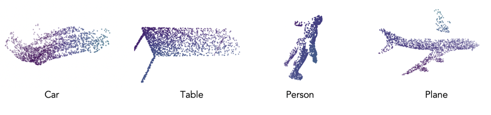

##### Completed Occluded Point Cloud:

-- PointNet:

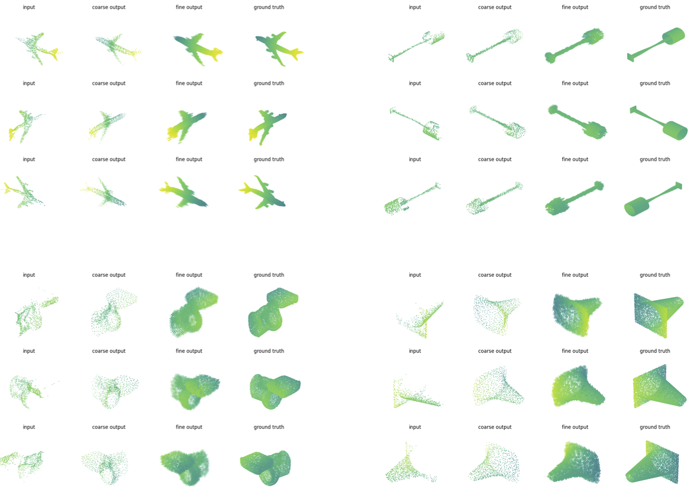

-- PCN:


-- DGCNN:

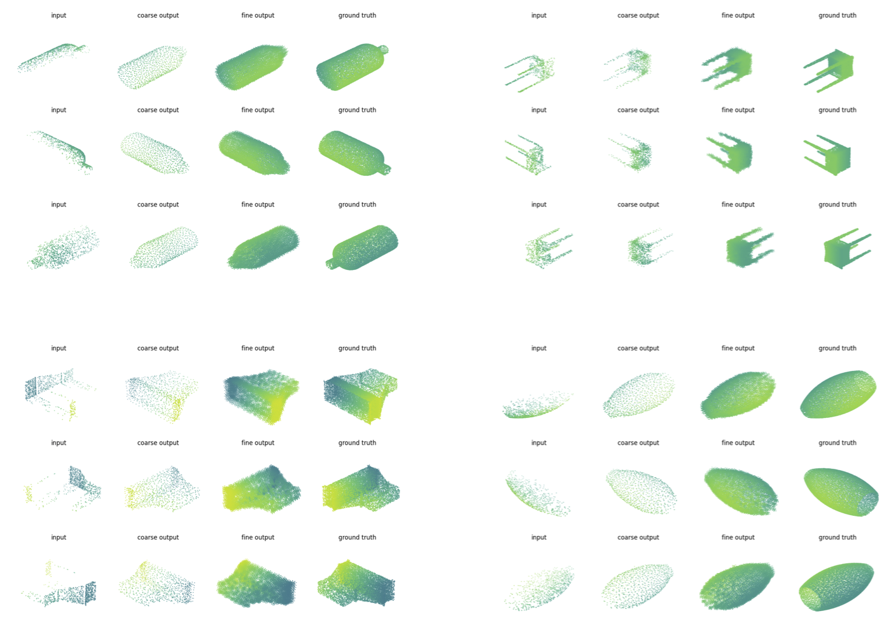

-- Failure Examples:

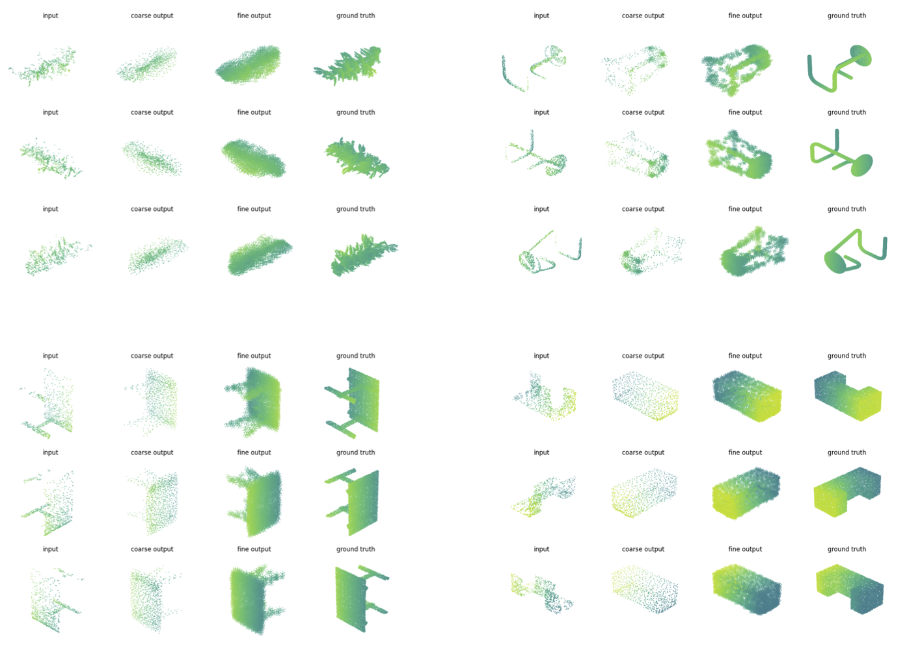

##### T-SNE Visualization:

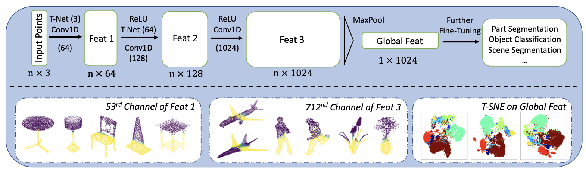


##### Classification (linear SVM):

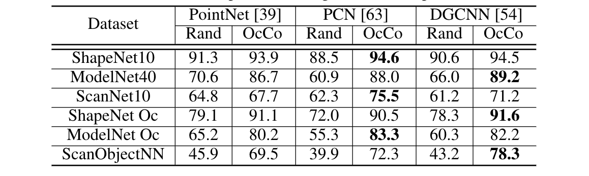

##### Classification (Networks):

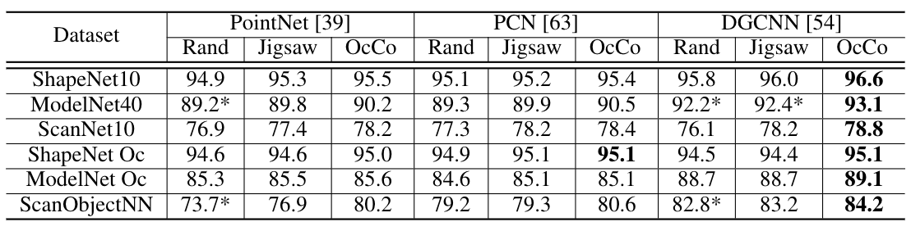

##### Semantic Segmentation:

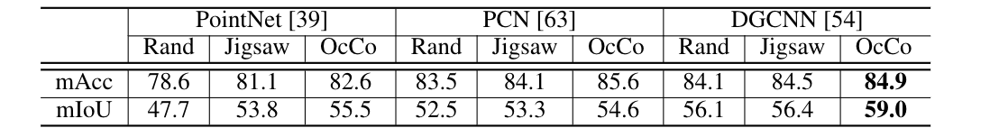

##### Sample Efficiency:

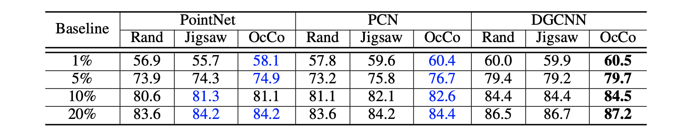

##### Learning Efficiency:

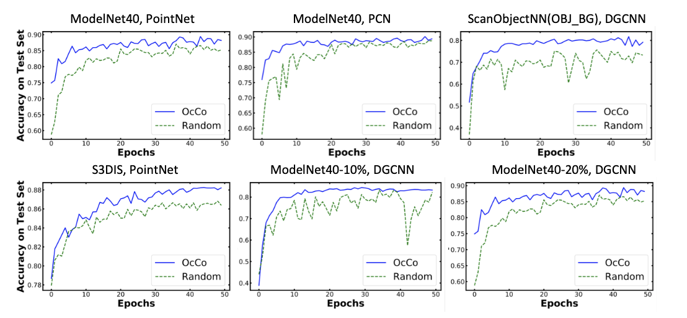


For the description and discussion of the results, please refer to our paper, thanks :)


### Contributing

The code of this project is released under the MIT License. 

We would like to thank and acknowledge references from the following repositories:

https://github.com/wentaoyuan/pcn

https://github.com/hansen7/NRS_3D

https://github.com/WangYueFt/dgcnn

https://github.com/charlesq34/pointnet

https://github.com/charlesq34/pointnet2

https://github.com/PointCloudLibrary/pcl

https://github.com/AnTao97/dgcnn.pytorch

https://github.com/QingyongHu/RandLA-Net

https://github.com/chrdiller/pyTorchChamferDistance

https://github.com/yanx27/Pointnet_Pointnet2_pytorch

https://github.com/AnTao97/UnsupervisedPointCloudReconstruction

We appreciate the help from the responsive, supportive and knowledge technicians Peter and Raf from Cambridge Engineering Department.

